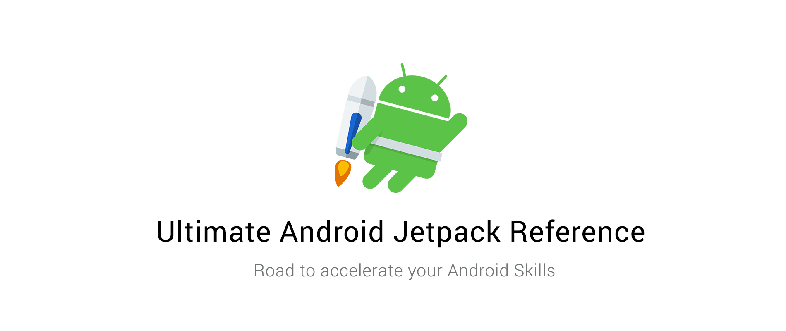

# Ultimate Android Jetpack Reference

        

> What's Android Jetpack

Android Jetpack is the next generation of components and tools along with Architectural guidance designed to accelerate Android Development. The main reasons are:
* Build high quality, robust apps
* Eliminate boilerplate code
* Accelerate development

#### Show Some :heart: by

  

## Categories

* [Architecture components](#architecture-components)
  - [Room](#room)
  - [Data Binding](#data-binding)
  - [Lifecycles](#Lifecycles)
  - [LiveData](#LiveData)
  - [Navigation](#Navigation)
  - [Paging](#Paging)
  - [ViewModel](#ViewModel)
  - [WorkManager](#WorkManager)
* Foundation components
  - AppCompat
  - Android KTX
  - Multidex
  - Test
* Behavior Components
  - Download manager
  - Media & playback
  - Notifications
  - Permissions
  - Sharing
  - Slices
* UI components
  - Animation & transitions
  - Auto
  - Emoji
  - Fragment
  - Layout
  - Palette
  - TV
  - Wear OS by Google
  
## Architecture Components

* Room

    - Fluent SQLite database access using Object Mapping Technique.
    - Need:
        - Less Boiler Plate code .i.e., Sends data to the SQLite database as Objects and not as Content Values and returns the result of executing a query as Objects as Cursors. 
        - Compile time validation of SQLite Queries.
        - Support for Observations like Live Data and RxJava
    - Makes use of Annotations for it's functioning and makes the API simple and neat to use.
    - Annotations:
        - @Entity: Defines the schema of the database table.
        - @dao: Stands for Database Access Object, used to perform read or write operations on the database
        - @database: As a database Holder. Creates a new Database based on supplied conditions, if it already exists it establishes a connection to the pre-existing database.
        

